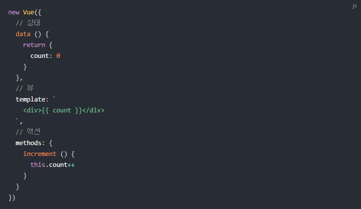

# [[Vue Study]]

## (2019-07-18)

### - Vuex란?

- Vuex는 Vue.js 애플리케이션에 대한 [상태 관리 패턴](#상태-관리-패턴) + 라이브러리 입니다.
- 애플리케이션의 모든 컴포넌트에 대한 중앙 집중식 저장소 역할 및 예측 가능한 방식으로 상태를 변경할 수 있습니다.

#### - 상태 관리 패턴

- 상태 는 앱을 작동하는 원본 소스 입니다.
- 뷰 는 상태의 선언적 매핑입니다.
- 액션 은 뷰 에서 사용자 입력에 대해 반응적으로 상태를 바꾸는 방법입니다.
