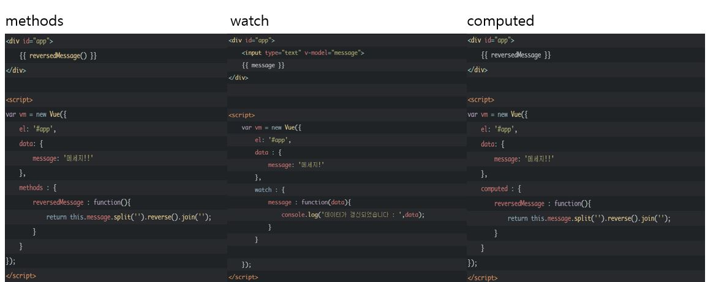
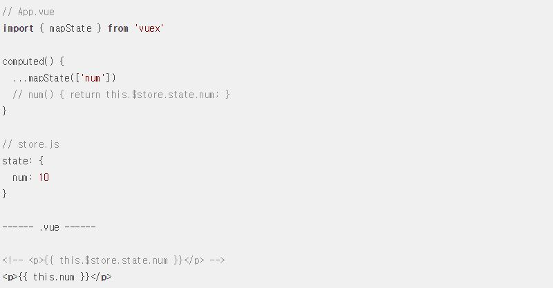
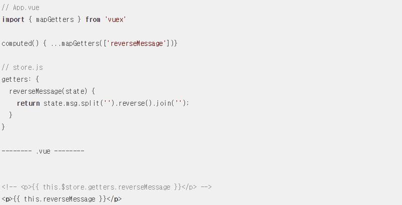
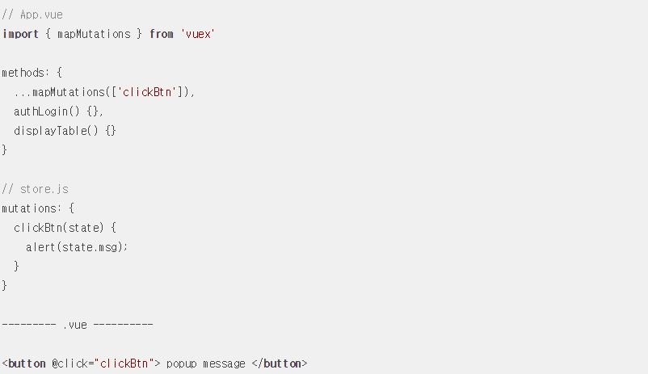
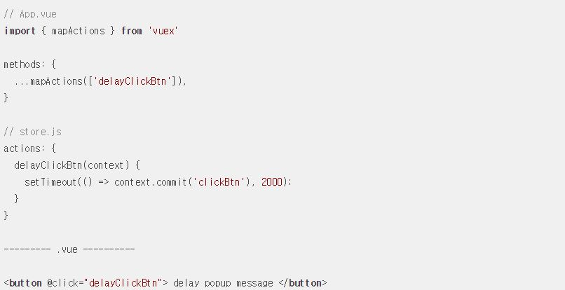

# [Vue Study]

## 목차
#### [2019-07-18](#(2019-07-18))
- [Vuex](#Vuex)
- [Computed](#Computed)
- [map 헬퍼 함수](#map-헬퍼-함수)

## (2019-07-18)

### Vuex

- Vuex는 Vue.js 애플리케이션에 대한 [상태 관리 패턴](#상태-관리-패턴) + 라이브러리 입니다.
- 애플리케이션의 모든 컴포넌트에 대한 중앙 집중식 저장소 역할 및 예측 가능한 방식으로 상태를 변경할 수 있습니다.

 

#### - 상태 관리 패턴

- 상태 는 앱을 작동하는 원본 소스 입니다.
- 뷰 는 상태의 선언적 매핑입니다.
- 액션 은 뷰 에서 사용자 입력에 대해 반응적으로 상태를 바꾸는 방법입니다.

 

### Computed
- data 속성에 변화가 있을때 자동으로 다시 연산

#### - methods vs computed
- methods : 캐싱이라는 개념이 없어 매번 재 렌더링
- computed : data 속성인  message 프로파티가 변화가 있을때만 다시 연산을 하고 한번 연산한 값을 캐싱하여 필요한 부분에 재사용

#### - computed vs watch
- computed : 내장 Api를 사용하는 간단한 연산 정도
- watch : 데이터 호출과 같은 시간이 상대적으로 더 많이 소모되는 비동기 처리

 

### map 헬퍼 함수

#### - mapState
- Vuex에 선언한 state 속성을 뷰 컴포넌트에 더 쉽게 연결해주는 헬퍼

#### - mapGetters
- Vuex에 선언한 getters 속성을 뷰 컴포넌트에 더 쉽게 연결 해주는 헬퍼

#### - mapMutations
- Vuex에 선언한 mutations 속성을 뷰 컴포넌트에 더 쉽게 연결 해주는 헬퍼

#### - mapActions
- Vuex에 선언한 actions 속성을 뷰 컴포넌트에 더 쉽게 연결 해주는 헬퍼

